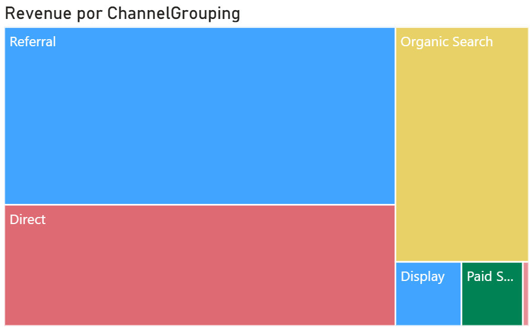
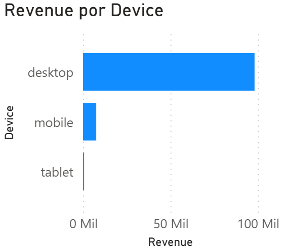
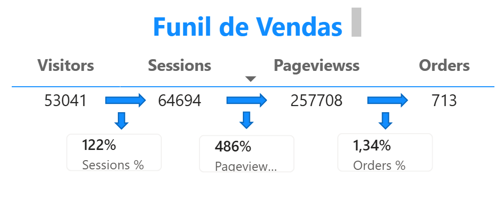
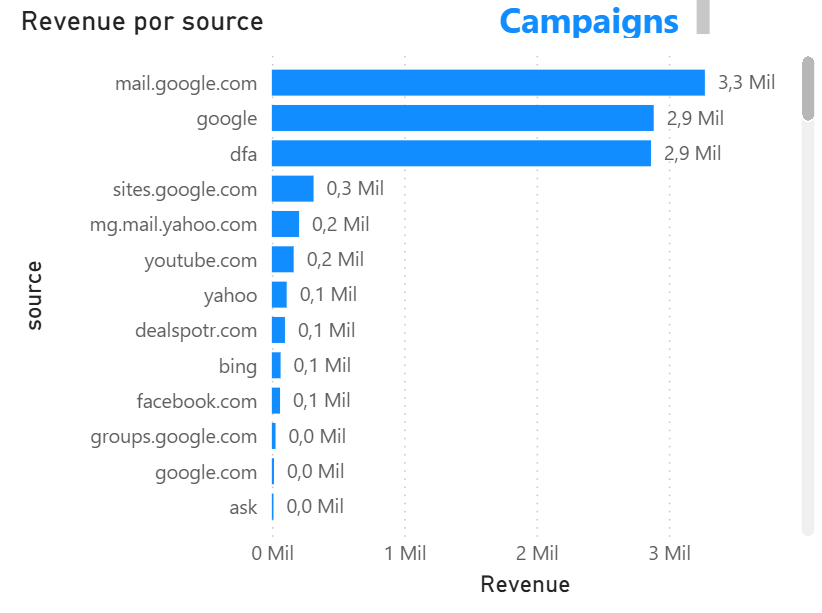

# Dashboard de Análise – Google Store

## Descrição do Projeto

  

Este projeto consiste na análise de dados do **Google Analytics Sample Dataset**, com o objetivo de construir um dashboard interativo no Power BI.

O foco é entender o comportamento dos usuários, as fontes de tráfego e a performance comercial (receita e conversão).

Link do projeto:

---

## KPIs (Indicadores Principais)

* 💰 **Receita Total:** 106K
* 🛒 **Total de Pedidos:** 713
* 👤 **Total de Visitantes:** 53K
* 📈 **Taxa de Conversão:** 1,34%

---

## Visualizações Principais

* Receita e Transações por dia
* Receita por fonte de tráfego
* Receita por canal (Treemap)
* Receita por dispositivo (Desktop vs Mobile)
* Visitantes por canal (Donut Chart)
* Funil de vendas (Visitors → Sessions → Pageviews → Orders)

---

## 🔥 Insights (Análises)

🔴 **Insight importante**
👉 O canal *Referral* gera a maior parte da receita
* 📌1 (aqui a imagem do treemap)

  

---

🔴 **Insight importante**
👉 Usuários de *Desktop* geram mais receita que Mobile
* 📌2 (aqui a imagem do gráfico de device)

  

---

🔴 **Insight importante**
👉 A taxa de conversão é relativamente baixa (~1,34%)
→ Indica oportunidade de otimização do funil
* 📌3 (aqui a imagem do funil)

  

---

🔴 **Insight importante**
👉 Algumas fontes trazem tráfego, mas não geram receita
→ Possível problema na qualidade do tráfego
* 📌4 (aqui a imagem do gráfico de fontes)

  

---

## 🛠️ Etapas do Projeto

1. Importação dos dados do Google Analytics
2. Limpeza e transformação dos dados (Power Query)
3. Criação de medidas em DAX (Receita, Pedidos, Conversão)
4. Construção das visualizações
5. Criação do funil de vendas
6. Implementação de filtros (data, período)
7. Organização e design do dashboard

---

## Desafios Encontrados

* Manipulação de dados complexos (campo `hits` em JSON)
* Problemas de performance devido ao volume de dados
* Ajuste e conversão de datas
* Criação correta das medidas DAX
* Estruturação do funil de vendas

---

## 🎯 Objetivo do Projeto

Demonstrar habilidades em:

* Análise de dados
* Construção de dashboards interativos
* Criação de KPIs relevantes
* Geração de insights de negócio

---

## Ferramentas Utilizadas

* Power BI
* DAX
* Power Query
* Google Analytics Dataset

---

## 📌 Conclusão

O dashboard permite analisar a performance do e-commerce e identificar oportunidades de melhoria, principalmente na taxa de conversão e nas fontes de tráfego.

---
